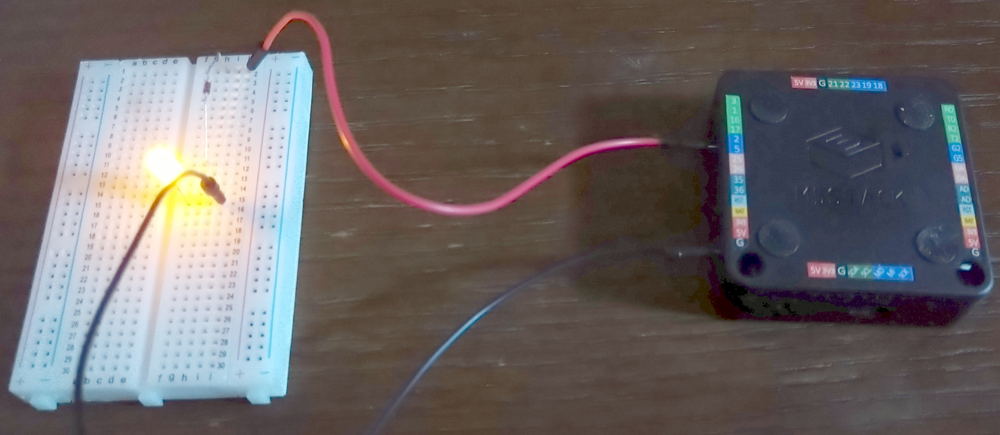
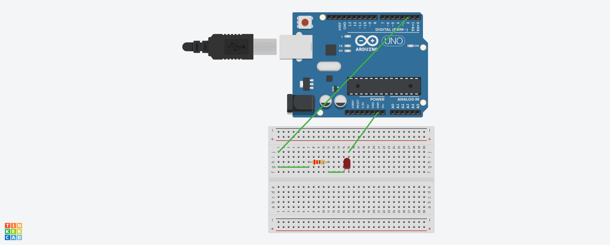

# M5Stack4everyone_by_rust
[みんなのM5Stack入門 下島健彦 著](https://www.ric.co.jp/book/hobby/detail/255)に掲載されているプログラムをRustで書き直したものです。

開発環境の準備には[こちらのリポジトリ](https://github.com/Tremendous1192/m5stack-basic-no-std-template)をご参照ください。

```cargo espflash flash --example module_name```でそれぞれのプログラムを実行できます。

# M5Stack Basic V2.7
[スイッチサイエンス](https://www.switch-science.com/products/9010)より引用。
プロトタイピングでよく使われる機能を詰め合わせたマイコンモジュールのようです。
> 本製品はESP32を搭載したM5Stack開発キットです。回路設計、ソフトウェア、外装などの設計を新しくしたことで、IoTとしてより親しみやすい製品になっています。
> 
> 本製品はWi-Fi、Bluetoothの通信規格が利用できるデュアルコアのESP32、および16 MB SPIフラッシュを搭載しています。また、30以上のスタック可能なモジュールと、40以上の拡張ユニットがあるため、高速なプロトタイプ制作が可能です。対応している開発環境はArduinoの他、UIFlow、MicroPython等があり、プログラムスキルに関係なく、最終的な製品化までサポートできます。
> 
> M5Stack Basicは二つのパーツで構成されており、上部パーツにプロセッサなどのコンポーネント、下部パーツにリチウムバッテリー、M-Busソケットなどがあります。

## ドキュメント
* [basic](https://docs.m5stack.com/en/core/basic)
* [I/O (GPIO/ADC/DAC/PWM)](https://docs.m5stack.com/en/api/core/gpio)


# プログラム説明
## スケッチ3.2 HelloWorld2
ディスプレイ上の座標(40, 60)に"Hello World"の文字を表示します。

```cargo espflash flash --release --example sketch_03_02_hello_world_2```

## スケッチ3.3 drawLine
ディスプレイ上の座標(0, 0)から(319, 239)に至るまでの白い直線を表示します。

```cargo espflash flash --release --example sketch_03_03_draw_line```

## スケッチ3.4 drawLine2
ディスプレイ上に複数の直線を表示します。
ILI9342Cクレートのバグなのか赤と青・白と黒が反転しています。

```cargo espflash flash --release --example sketch_03_04_draw_line_2```

## スケッチ3.5 RectCircl
ディスプレイ上に四角形を1つ、円を2つ描画します。

```cargo espflash flash --release --example sketch_03_05_rect_circle```

## スケッチ3.6 bmp(書籍ではjpeg)
8ビットbmp画像を画面に表示します。
[最近の画像は24ビットや32ビットなどの高画質な画像が多いので8ビットに変換してください](https://nako-itnote.com/8bit-bmp-convert/)

```cargo espflash flash --release --example sketch_03_06_bmp```

## スケッチ3.7 btnAvatar
ボタンを押すと画面の表情を切り替えます。

```cargo espflash flash --release --example sketch_03_07_btn_avatar```

## スケッチ3.8 speaker
内蔵スピーカを鳴らします。

うるさいのと周波数調整ができません。

```cargo espflash flash --release  --example sketch_03_08_speaker```

## スケッチ4.1 Lchika
Lチカのプログラムです。

写真写りが悪いのでTinker CADで描いた回路図を下記に記します。

(M5Stackを扱っていないようなので、Arduinoで代用します)

> ```cargo espflash flash --release --example sketch_04_01_lchika```






# 参考
* [みんなのM5Stack入門 下島健彦 著](https://www.ric.co.jp/book/hobby/detail/255)
* [「みんなのM5Stack入門」プログラム集](https://github.com/AmbientData/M5Stack4everyone)
* [Tremendous1192/m5stack-basic-no-std-template](https://github.com/Tremendous1192/m5stack-basic-no-std-template)

* [M5Stack Basic V2.7](https://www.switch-science.com/products/9010)

* [画像を8bitのBMPに変換する3つの方法（高画質&一括で変換する方法も） | nakoのITノート](https://nako-itnote.com/8bit-bmp-convert/)

* [Tinkercad](https://www.tinkercad.com/)

リポジトリ
https://github.com/playfulFence/esp-crispy-click/tree/43f82fa013f7697e6c0221044db2ce7452202752
main
https://github.com/playfulFence/esp-crispy-click/blob/43f82fa013f7697e6c0221044db2ce7452202752/src/main.rs

mipidsi crate の示唆
https://twitter.com/notjessebraham/status/1563263764329529345


